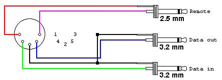

# Getting Started with the Tandy Color Computer

I just got a Tandy Color Computer 2, and I was rather frustrated by the lack of helpful information for someone who's never seen a CoCo before in their lives. Don't get me wrong, there is a *ton* of information about the CoCo out there, but nothing that's quite like the "okay so you've used old computers before but you just want to know why your CLOAD command isn't working" guide that I was looking for. This guide will be a little more basic than what I was looking for, because I was already familiar with many of the barebones basics, but this should be a useful guide for people looking for a one-stop-shop to getting their new CoCo up and running. To my knowledge the information here applies equally to all 3 CoCo models, but bear in mind I have only ever used the Coco 2.

- [Getting Started with the Tandy Color Computer](#getting-started-with-the-tandy-color-computer)
  - [Connections](#connections)
    - [TV](#tv)
    - [Cassette Port](#cassette-port)
      - [Actual Cassettes](#actual-cassettes)
      - [Connecting to computer/phone](#connecting-to-computerphone)
      - [Building a cassette cable](#building-a-cassette-cable)
  - [Loading Software](#loading-software)
    - [FM ERROR](#fm-error)
    - [IO ERROR](#io-error)
    - [SN ERROR](#sn-error)
    - [Troubleshooting](#troubleshooting)
  - [Running Software](#running-software)
  - [Color BASIC](#color-basic)
    - [Commands](#commands)
    - [Programming](#programming)
  - [Joysticks](#joysticks)
    - [Calibrating Joysticks](#calibrating-joysticks)
  - [Links](#links)

## Connections

### TV

The Color Computer manual does a good job explaining this. They're easy to find but links are provided at the bottom of the page. If you are looking for the name of the screw-on coaxial connector so you can buy an adapter, it's an "RCA to F Type" adapter. You might get better picture quality using thicker coaxial cable (sold for SPDIF coax use, or RG-59 spec) than typical RCA cable.

Because in the present day it is easiest to load software into the CoCo from a modern computer, I bought a cheap old analog TV tuner for PC and hook my CoCo up to that.

### Cassette Port

#### Actual Cassettes

If you have actual CoCo software on cassette that you want to run, and have a working cassette deck, then good on ya. You can hook up the cables like they show in the manual. If you have the cable but not a Tandy deck, the black plug goes into the EARPHONE jack, and the grey 3.5mm plug (the bigger one) goes into the deck's MICROPHONE jack. The small plug is only for use with Tandy decks and can be ignored otherwise. You only need the microphone plug to save software, if you only need to load software you only need the black plug (and a deck without recording capabilities).

#### Connecting to computer/phone

If you want to load software from a modern computer or phone, you will still need a cassette cable. Plug the black plug of the cassette cable into the headphone jack of your computer. If you want to save programs you write back to your computer, you can plug the 3.5mm grey plug (the bigger one) into your computer's line-in jack (or microphone jack). You can try to do this all with a phone using a headset splitter. Obviously you need a phone with a headphone jack.

#### Building a cassette cable

If you don't have a cassette cable, but you know how to solder, you can build your own in about 5 minutes by cannibalizing some spare MIDI and aux cables. Or you can buy the parts on eBay for like $5.

You'll need a 5-pin DIN connector. You can buy just the plugs on eBay, which tend to be easier to solder, or you can cut the end off of a MIDI cable. You'll also need 2 (well, only 1 if you don't want to be able to save programs) 3.5mm headphone jacks. Cutting an aux cord in half works well enough, but sometimes their wires are so thin they're hard to solder.

Follow the diagram, note that 3.2mm = 3.5mm, and that you can use stereo plugs as long as you wire to the tips. Ignore the remote plug, and note which plug is data out and data in. If you need a remote plug for use with a Tandy deck, you probably can't use a MIDI cable as most only have 3 conductors. Connect the DATA_OUT plug to your computer's line in/mic jack, and the DATA_IN plug to your computer's headphone jack.



## Loading Software

So once you've got it hooked up and you see the bright green screen, you are in a Color BASIC prompt. Hopefully, you've downloaded some software from somewhere like [the color computer archive](https://colorcomputerarchive.com). Note only cassette software can be loaded this way. Typically you'll download ZIPs containing a WAV file. With your cassette cable hooked up to your computer, and your CoCo in BASIC, type `CLOAD` and hit Enter. You should see an S appear in the top left corner of the screen.

The S in the corner means that the machine is listening for input from the cassette. Push Play on the WAV file you are trying to load. When the computer picks up the signal from the WAV, the S will turn black.

The machine itself makes an audible click when reading from cassette starts. You can hear the relay engage from under the keyboard.

If the S never turns black, then that means that the computer is not receiving the signal. You can try turning up the volume on your computer. Make sure you have any audio processing turned off, such as AudioFX on Android, any kind of EQs, compressors, virtual surround modes, etc. should be turned off. You want the volume going out to the device to be roughly 3/4 of the machine's maximum input. It's hard to know it's maximum compared to your computer's or phone's, so start at about 80% and work your way down. I found that Android did not provide fine enough control over the volume to dial in the sweet spot. The real factor here is impedance, which I think is why I've found the machine to be less picky with older devices, and unusable with Android.

Once the S turns black, you should eventually see it become an F, and then a filename will appear to the right. If you got incredibly lucky, it will load that file and say OK. Chances are though, if you got the machine to read the signal at all, you got an error.  

### FM ERROR

This means you are loading the wrong type of program. `CLOAD` can only load BASIC programs, whereas `CLOADM` must be used to load "machine language" programs. Try `CLOADM` and try again. Most commercial software is machine language, but there's a ton of BASIC floating around on the archive, so you'll just have to guess, usually.

### IO ERROR

This usually means that the volume on your computer is wrong. Try lowering the volume first, but adjust as necessary until you find a sweet spot. It is possible that the impedance of your device is simply incompatible with the CoCo, and you may need to try a different device.

### SN ERROR

SN is a Syntax error. This means that you typed the command in incorrectly.

### Troubleshooting

Run the command `AUDIO ON` and then hit play on the WAV file. With `AUDIO ON`, any sound coming into the computer via the cassette cable will be played through the TV speakers. You should hear nasty Fax/Modem sounds if the file is playing correctly.

If you are unsure if your CoCo is producing sound at all, you can run `SOUND 40,5` which will play a tone.

Check your cables and connections.

## Running Software

Once the program has loaded in from "tape," you need to tell the computer to run it.

If the program is BASIC (loaded via `CLOAD`), use `RUN`

If the program is machine code (loaded via `CLOADM`), use `EXEC`

BASIC programs can be paused with SHIFT+@ and ended with BREAK. Binary programs generally can only exited by resetting the system.

## Color BASIC

### Commands

In addition to `CLOAD` and `CLOADM`, there are also `CSAVE` and `CSAVEM` which behave in the same ways, respectively. You can record the CoCo's output from the grey (data out) cable to a WAV file or cassette using your phone or computer, and then you can load that WAV back into the CoCo whenever you want.

`CLS` clears the screen. `CLS X` where `X` is an integer between 1 and 8 sets an alternate color mode, though commands will still be black on green.

`NEW` clears memory. The CoCo can only have one program loaded in memory at a time. This erases any lines of code you've already entered.

`SOUND X,Y` plays a sound, where X is pitch (1-255) and Y is duration (1-?)

`LIST` prints all of the lines of code currently in memory

`LOAD` for loading files from a disk drive. Not used with cassette data, but is used with floppies or disk images loaded via [DriveWire](#drivewire). Must provide a file name which must be in quotes, e.g. `LOAD "GOLF.BAS"`

`LOADM` same as `LOAD` but for machine code, e.g. `LOADM "ZAXXON.BIN"`

That should get you started. See Getting Started with [Extended] Color Basic, available from the Color Archive for a full introduction.

### Programming

When you enter a command and hit Enter, you are technically writing a line of BASIC code, then running it and throwing it away.

If you start a line with a number, you will instead store that line of code as a line of a program in memory to be run when you later specify. Conventionally, BASIC programs have line numbers starting with 10 and increasing by 10, so 10, 20, 30, etc. This lets you insert lines in between should you need to later on.

If you mess up a line, or want to change it later, just write a new line starting with the same number, and it will be overwritten.

To see the program thus far, run `LIST`.

Here's a quick example program that should demonstrate some basic syntax. There's another example in the [Joystick](#joysticks) section.

```BASIC
10 FOR X = 1 TO 255
20 SOUND X,1
30 IF X < RND(255) THEN 100
40 NEXT X
50 END
100 Y = RND(8)
110 CLS(Y)
120 GOTO 40
```

The `IF...THEN` syntax is kind of weird. Think of `THEN` as `GOTO`, and remember there are no brackets so you have to specify what gets executed when.

There is no timer routine. Documents suggest an empty loop of 390 cycles equals one second, like so:

```BASIC
10 FOR X = 0 TO 390
20 NEXT X
```

## Joysticks

Counterintuitively for people who grew up in the modern era, the CoCo generally considers "Right Joystick" to be Player 1.

Also counterintuitively for us fellow kids, the black standard joysticks have the button on the top and the cable coming out the bottom. The arrow on the joystick points up.

If you have a Deluxe Joystick, it's probably best not to mess with the Fixed/Center switches on the back. Mine only kind of barely work. If you insist on playing with them, heed the printed warning and move the stick all the way to the lower right corner before flipping them.

### Calibrating Joysticks

I wrote this little program, which is available in [WAV form in the Links section](#links)

```BASIC
10 X1 = JOYSTK(0) - 32
20 Y1 = JOYSTK(1) - 32
30 X2 = JOYSTK(2) - 32
40 Y2 = JOYSTK(3) - 32
50 PRINT "RIGHT JOY"
60 PRINT X1
70 PRINT, Y1
80 PRINT "LEFT JOY"
90 PRINT X2
100 PRINT, Y2
110 PRINT
120 PRINT
130 PRINT "TANDY DELUXE JOYSTICK"
140 PRINT "CALIBRATION PROGRAM"
150 PRINT "ADJUST SLIDERS SO NUMBERS READ"
160 PRINT "AS CLOSE TO ZERO AS POSSIBLE"
170 FOR Z = 0 TO 160
180 NEXT Z
190 CLS
200 GOTO 10
```

Use `BREAK` to exit the program.

## Links

- [Joystick calibration program (WAV)](../archive/coco/joytest.zip)
- [Color Computer Archive Manuals Section](https://colorcomputerarchive.com/repo/Documents/Manuals/Hardware/)
  - Color Computer [1/2/3] Operation Manual
  - Getting Started with Color [Extended] BASIC
  - Color Computer [1/2/3] Quick Reference Guide
  - Color Computer Disk System Quick Reference Guide
- [Color Computer Archive Programming Manuals](https://colorcomputerarchive.com/repo/Documents/Manuals/Programming/)
  - [Color BASIC and Extended System Reference Card](https://colorcomputerarchive.com/repo/Documents/Manuals/Programming/TRS-80%20Color%20Basic%20and%20Extended%20System%20Reference%20Card%20(Nano%20System%20Corp.).pdf)
- [Color Computer Archive Cassettes Section](https://colorcomputerarchive.com/repo/Cassettes/)
- [Curtis Boyle's Games Site](http://www.lcurtisboyle.com/nitros9/coco_game_list.html)