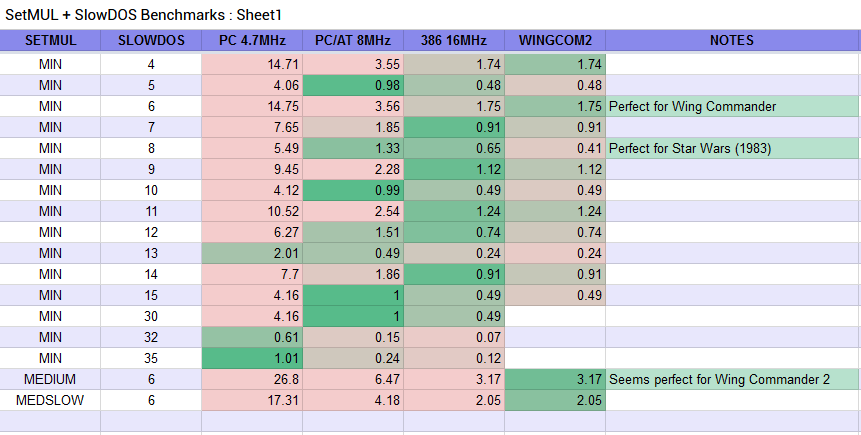

# SetMUL, SlowDOS, and Ancient DOS Games on a Pentium MMX 233

{:.tree-view}
- [SetMUL, SlowDOS, and Ancient DOS Games on a Pentium MMX 233](#setmul-slowdos-and-ancient-dos-games-on-a-pentium-mmx-233)
  - [SetMUL](#setmul)
  - [SlowDOS](#slowdos)
  - [MIPS](#mips)
  - [Results and Notes](#results-and-notes)
    - [MIPS](#mips-1)
    - [Results](#results)
    - [SetMUL Settings:](#setmul-settings)
    - [SlowDOS Usage](#slowdos-usage)
  - [Compatibility](#compatibility)

## SetMUL

The always incredibly Phil's Computer Lab has done a couple videos on using software utilities, such as SetMUL, to slow down "fast" processors like an i586 down to i386 levels so as to run certain older DOS games, most famously Wing Commander. [Phil's article includes links and some technical information](https://www.philscomputerlab.com/136-in-1-pentium-mmx.html) and some batch scripts which use the SetMUL utility. SetMUL's main function is to disable CPU caches, greatly reducing speed. For AMD and Cyrix x86 equivalents, it has some clock adjustment options, and for an i586 like my Pentium MMX, it offers a handful of additional tweaks, such as disabling branch predictio and the V Pipeline. 

Phil's guide does not work for me, however, even though I'm using the exact same processor. The problem is that in order to get all the way down to true 386 speed on an MMX 233, Phil had to disable both the on-die CPU cache and the motherboard CPU cache. While I'm sure the majority of boards from the Socket 7 era support disabling the motherboard cache in BIOS, I am running DOS [on a laptop,]() and its BIOS does not give me this option. As a result, the lowest I could get my 3dbench2 score was 32.4...about 3 times too fast to run Wing Commander correctly. 

## SlowDOS

I needed to find an alternative method of slowing down the machine. I tried countless programs, mostly shareware that was listed in this [old VOGONS thread](https://www.vogons.org/viewtopic.php?t=44). Much to my chagrin, though, nothing was working. I did eventually get Bremze working to an extent (as in, I did get it to slow the computer down, but I could not get it to work right with any games) but it was the only one, and I was not prepared to pay the $30 license fee to experiment further. 

Luckily, I found that SlowDOS did work for me. I had initially overlooked it, because [it shares a webpage with Throttle,](http://www.oldskool.org/pc/throttle/DOS) which did not work for me at all (it's at the bottom of the linked page). On its own, it didn't seem capable of slowing the machine down quite far enough for Wing Commander, and it certainly couldn't get low enough to play mid-80s 8088/286 games like Star Wars. Luckily, SlowDOS is compatible with SetMUL, and with a combination of them I was able to get some usable configurations going. 

## MIPS

MIPS is an old benchmarking app from Chips and Technologies. The program runs a benchmark on your PC (calculating your machine's MIPS) and shows you a comparison against some standard configurations: an IBM PC 5150 (8088 4.7MHz), an IBM PC/AT (286 8MHz), and a Compaq Deskpro 386 (16MHz).  It presents your results as a ratio of the standard performance, so if you get a score of 1.0 then you have precisely matched the comparison machine's performance (in the program's estimation, anyway). 

Wing Commander is deisgned for a 386 at 33MHz, so none of the benchmarks perfectly align with that game in particular, though aiming for 1.0 on the 386 was where I started. 

Star Wars, an ancient game from 1983, would need as close to a 1.0 on the IBM PC bench as possible. At least, in theory. In practice, I found that it worked best on a config with a 1.33 on the PC/AT, even though the game came out in the 5150 era.

Wing Commander at 1.75x 386/16 speed seems just about spot on, but Star Wars was definitely a game designed for the 8088, so it's a bit surprising that it works best with a 1.33 score on the PC/AT...The scale within MIPS does not seem to be perfectly linear. When I nailed a 1.0 on the 8088 bench, it was too slow to even run ancient games like Star Wars or Robotron. So keep that in mind. 

## Results and Notes

### MIPS

I ended up using MIPS for all of these benchmarks because the way 3DBench2 works causes it to report wildly inaccurate numbers when using a software slowdown like SlowDOS, as well as easy comparisons to old test systems. 

MIPS is not useful as a general purpose benchmark, though, as it only reports values relative to those 80s PCs, and itself seems to have some inaccuracies. Even worse, while it would be fun to see just how much faster a Pentium MMX is than an 8088 at full throttle, the output from the program breaks if any value is over 100. So no such luck there, either. 

### Results

I compiled the results of my testing in [this spreadsheet](https://docs.google.com/spreadsheets/d/e/2PACX-1vSWqB9XGJ9zThTOHZHxG6pueDZsJzTeW5Wo1cs1ovNmiW5ij-HUrd9sRSZ-khUFDR-udNyDOChc4zOz/pubhtml). If you do additional testing, please share! I will update it if I receive more info. 

### SetMUL Settings:

The SetMUL values in the spreadsheet are as follows. I'm just writing out the commands so that you can use them in batch scripts. 

 - MIN:     `setmul ccd dcd bpd vpd l1d`
 - MEDSLOW: `setmul ccd bpd vpd`
 - MEDIUM:  `setmul ccd`
 - MAX (for reset): `setmul pfe l1e l2e bpe vpe cce dce`

### SlowDOS Usage

You run SlowDOS by running `slowdos /DXX`, where `XX` is the delay value, from 00 to 99 (though your system will be unusable above about 40)

## Compatibility

I was impressed with the compatibility in general, but one standout problem was with [SoftMPU](http://bjt42.github.io/softmpu/). SoftMPU breaks SlowDOS, and they cannot be used in conjunction--SoftMPU will work, but SlowDOS will not, and the game will run too fast. The sad thing is that this means no MT-32 in Wing Commander, though the OPL3 soundtrack is honestly phenomenal as it is. 